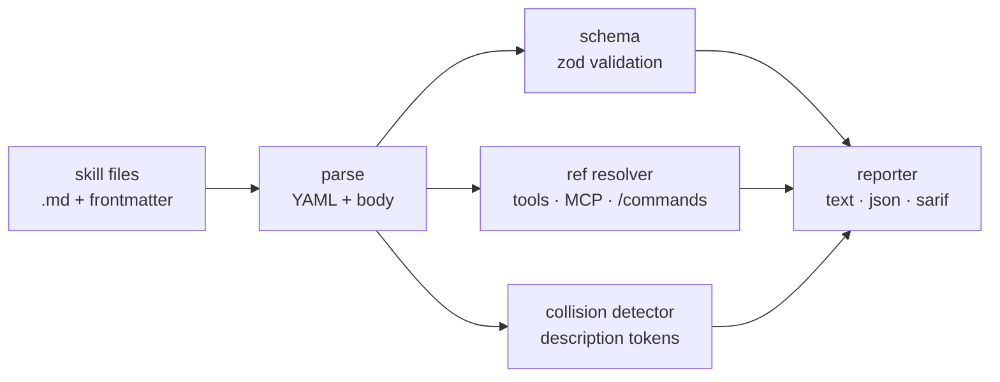

<div align="center">

# `skillcheck`

### static analyzer for Claude Code skills

**Lint the manifest. Verify the refs. Catch the collisions before runtime.**

[](./LICENSE)
[](#roadmap)
[](#install)

</div>

A linter for Claude Code skill packages. Validates frontmatter against a
schema, checks every referenced tool / MCP server / slash-command actually
resolves, flags description-trigger collisions across a skill set, and
warns when a skill's `description` will compete with another for the same
prompt.

> **The thesis.** Skills are an authoring surface, not a runtime. The
> runtime is opaque — you only find out a skill is broken when an agent
> silently picks the wrong one, or invokes a tool that no longer exists.
> `skillcheck` makes that loop fast and pre-flight: parse the manifest,
> walk the references, score the collisions, fail CI.

---

## ✦ What it checks

| Check | Severity | What |
|---|---|---|
| Frontmatter schema | error | `name`, `description`, `tools` parse, types match |
| Tool reference | error | Every tool in `tools:` resolves to a known built-in or MCP tool |
| MCP server reference | error | `mcp__<server>__<tool>` strings name a configured server |
| Slash-command reference | warn | Every `/cmd` mentioned in body exists in `.claude/commands/` |
| Description collision | warn | Two skills overlap on triggers (token-set Jaccard ≥ 0.6) |
| Body length | warn | Skill body > 4000 chars (Claude tends to skim past) |
| Frontmatter drift | warn | `name:` doesn't match the directory or filename |
| Unused trigger words | info | Description mentions terms that never appear in the body |

## ✦ Usage

```bash
npx skillcheck                          # lint every skill in .claude/skills/
npx skillcheck path/to/skill.md         # lint one
npx skillcheck --strict                 # warnings → errors (for CI)
npx skillcheck --format json            # machine-readable
npx skillcheck --format sarif           # GitHub code-scanning
```

Exit codes: `0` clean, `1` errors, `2` warnings only (with `--strict`).

## ✦ How



Pure Node, no runtime dep on Claude Code itself. Reads
`~/.claude/settings.json` and `.claude/settings.json` to know which tools
and MCP servers are configured.

## ✦ Roadmap

- [ ] v0.1 — frontmatter schema + tool ref check
- [ ] v0.2 — MCP server ref check
- [ ] v0.3 — description collision detector (Jaccard)
- [ ] v0.4 — SARIF output for GitHub code-scanning
- [ ] v0.5 — `--fix` mode for safe auto-corrections
- [ ] v1.0 — used by `erphq/skills` in CI; documented schema

## ✦ License

MIT — see [LICENSE](./LICENSE).
