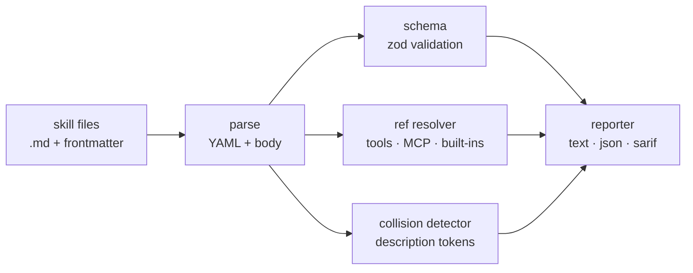

<div align="center">

# `skillcheck`

### static analyzer for Claude Code skills

**Lint the manifest. Verify the refs. Catch the collisions before runtime.**

[](https://github.com/erphq/skillcheck/actions/workflows/ci.yml)
[](./LICENSE)
[](#roadmap)
[](#install)

</div>

A linter for Claude Code skill packages. Validates the YAML frontmatter
against a schema, checks every referenced tool / MCP server actually
resolves, scores description-trigger collisions across a skill set, and
warns about authoring pitfalls Claude won't tell you about at runtime.

> **The thesis.** Skills are an authoring surface, not a runtime. The
> runtime is opaque - you only find out a skill is broken when an agent
> silently picks the wrong one, or invokes a tool that no longer exists,
> or skips your skill entirely because three other skills described the
> same trigger. `skillcheck` makes the loop fast and pre-flight: parse
> the manifest, walk the references, score the collisions, fail CI.

---

## ✦ Why a linter, not a runtime tester

Two reasons.

**Runtime testing is slow and expensive.** End-to-end testing a skill
means running a real model against real prompts and observing what gets
selected. That's a network round-trip and a billing line per check. A
linter runs in milliseconds, finds 80% of the bugs, and costs nothing.

**The runtime is opaque.** Claude won't tell you "I almost picked your
skill but the description was ambiguous, so I picked the other one." It
just does. Static checks are the only way to surface authoring problems
before they hide in production.

## ✦ The bugs `skillcheck` catches

| Bug | What happens at runtime | What `skillcheck` does |
|---|---|---|
| Missing `description` | Skill silently never selected | Error |
| Tool listed in `tools:` was renamed | Skill invokes ghost tool, fails | Warn |
| Two skills with overlapping descriptions | Wrong one fires | Warn (Jaccard) |
| Description longer than 500 chars | Registry pollution; trigger dilution | Warn |
| Frontmatter `name:` doesn't match the file | Confused lookups, lost skills | Warn |
| MCP tool string typo (`mcp__githhub__...`) | Skill invokes ghost tool | Error |
| MCP server not configured | Skill works for author, breaks for users | Warn |

Every one of these is an actual bug we've seen. None show up in the
model output - they show up as the skill not being selected, or being
selected but failing silently.

## ✦ Install

```bash
npm install -g skillcheck
# or one-shot, no install:
npx skillcheck
```

To run from source:

```bash
git clone https://github.com/erphq/skillcheck && cd skillcheck
npm install && npm run build
node dist/cli.js
```

Cutting a release: tag and create a GitHub Release named `vX.Y.Z`
matching `package.json`'s `version`. The `release.yml` workflow runs
the full lint + build + test pipeline, then `npm publish --provenance`
using the `NPM_TOKEN` repo secret.

## ✦ Usage

```bash
# lint every skill in the default location
skillcheck

# lint specific paths or globs
skillcheck path/to/skill.md
skillcheck "skills/**/*.md" "personal/*.md"

# fail CI on warnings
skillcheck --strict

# emit machine-readable output
skillcheck --format json
```

Exit codes:

| Code | Meaning |
|---|---|
| 0 | Clean (no errors; warnings allowed when `--strict` is off) |
| 1 | One or more errors |
| 2 | Warnings only, with `--strict` |

## ✦ What it checks

| Rule | Severity | Description |
|---|---|---|
| `frontmatter-schema` | error | `name` and `description` are required strings; `tools` is array or comma-string |
| `mcp-tool-format` | error | Strings starting with `mcp__` parse as `mcp__<server>__<tool>` |
| `tool-unknown` | warn | Tool is not a known built-in and not an MCP tool |
| `mcp-server-unknown` | warn | MCP tool references a server not configured in any `settings.json` |
| `description-length` | warn | Description longer than 500 chars dilutes the trigger signal |
| `name-drift` | warn | Frontmatter `name:` doesn't match the filename or directory |
| `description-collision` | warn | Two skills' descriptions have Jaccard ≥ 0.6 |
| `parse` | error | The file doesn't have valid frontmatter / YAML |

The MCP and built-in tool checks read `~/.claude/settings.json` and
`./.claude/settings.json` to know which servers are configured. If
neither exists, MCP server warnings are skipped (they'd be noise on a
fresh checkout).

## ✦ Example output

```text
skills/deploy.md
  warn  description-collision - description overlaps with 'release' (Jaccard 0.71)
  warn  description-length - description is 612 chars (>500)

skills/release.md
  warn  description-collision - description overlaps with 'deploy' (Jaccard 0.71)

skills/typo.md
  error frontmatter-schema - name: name is required
  warn  tool-unknown - tool 'BashShell' is not a known built-in Claude Code tool

1 error, 4 warnings, 0 info
```

## ✦ CI integration

Two-line GitHub Actions step:

```yaml
- run: npx skillcheck --strict --format json > skillcheck.json
- run: cat skillcheck.json | jq '.diagnostics[] | select(.severity=="error")'
```

Or simpler - fail the build on any warning:

```yaml
- run: npx skillcheck --strict
```

## ✦ How



Pure Node, no runtime dependency on Claude Code itself. Reads
`~/.claude/settings.json` and `.claude/settings.json` to know which tools
and MCP servers are configured. Designed to be vendored into a skill
repo's CI.

## ✦ Programmatic API

```ts
import { parseSkillFile, runChecks, loadConfig } from "skillcheck";

const config = await loadConfig(process.cwd());
const skill = await parseSkillFile("skills/deploy.md");
const diagnostics = runChecks([skill], config);
console.log(diagnostics);
```

Useful for piping into your own reporters, custom checks, or test suites.

## ✦ Anti-patterns this catches (and prevents)

| Anti-pattern | Why it's bad |
|---|---|
| Description that's a multi-paragraph essay | Claude has to read all skill descriptions every turn - long ones get skimmed |
| Two skills both described as "use this when working on X" | Selection is non-deterministic; one of them never fires |
| `tools: [Read, Edit, Bash, Write, ...]` (everything) | Defeats the purpose of `tools:`; signals the author didn't think about scope |
| `name: my-skill` in `skills/different/different-skill.md` | Skill name resolution diverges from file path |
| `mcp__github__create_issue` with no `github` MCP server configured | Skill works for author, breaks for everyone else |

## ✦ Non-goals

- **Runtime evaluation.** No LLM calls. We don't probe whether a skill is
  "good"; we only check whether it's well-formed and refer-able.
- **Skill generation.** We don't write skills for you.
- **Auth or sandboxing.** That's the runtime's job.
- **Plugin manifest validation.** Hooks, commands, and other plugin
  artifacts are out of scope (a separate tool).

## ✦ FAQ

**Q: Why are unknown tools a *warning* and not an error?**
A: The built-in tool list changes between Claude Code versions and isn't
published as a stable schema. We err on the side of not breaking your CI
when Anthropic ships a new tool.

**Q: How do I add my own checks?**
A: Pass `--plugin <path-or-specifier>` (repeatable). A plugin is a
module whose default export is `{ name, rules }`, where each rule
has an `id` and a `check(ctx)` that returns `Diagnostic[]`. The
context exposes the same `parsed` / `validated` / `config` the
built-in checks see, so you can write semantic checks against the
real frontmatter shape. A plugin rule that throws is converted to
an error diagnostic tagged `<plugin>/<rule-id>` so a buggy plugin
cannot take down the whole run. See the `SkillcheckPlugin` type
exported from `skillcheck`.

**Q: What about skills inside plugin directories?**
A: They work - point `skillcheck` at the directory. Plugin-namespaced
skills (`plugin:skill`) aren't validated against plugin manifests yet.

**Q: SARIF support?**
A: Shipped in v0.4 (`--format sarif`). Output conforms to SARIF 2.1.0
and is consumable by GitHub Code Scanning's `upload-sarif` action.
Every rule appears in `tool.driver.rules` with a stable id, name,
short description, and default level.

**Q: How does this differ from `markdownlint` or `eslint`?**
A: Those check syntax. `skillcheck` checks *semantics*: does this skill
refer to tools that exist, does this name match its file, do two skills
collide on triggers? Stylistic checks belong upstream of `skillcheck`.

## ✦ Roadmap

- [x] v0.0 - scaffold, schema, structure
- [x] v0.1 - frontmatter schema + tool ref check + tests
- [x] v0.2 - MCP server ref check
- [x] v0.3 - description collision detector (Jaccard ≥ 0.6)
- [x] v0.4 - SARIF 2.1.0 output for GitHub Code Scanning
- [x] v0.5 - npm publish + GitHub Actions release workflow (`--provenance`); CHANGELOG.md
- [x] v0.6 - `--fix` mode for safe auto-corrections (today: `name-drift`); plugin API
- [ ] v1.0 - used by `erphq/skills` in CI; documented schema versioned independently

## ✦ Topics

`claude-code` · `claude` · `ai-agents` · `linter` · `static-analysis` ·
`mcp` · `model-context-protocol` · `typescript` · `cli` · `devtools`

## ✦ License

MIT - see [LICENSE](./LICENSE).
